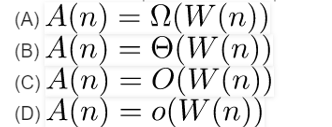
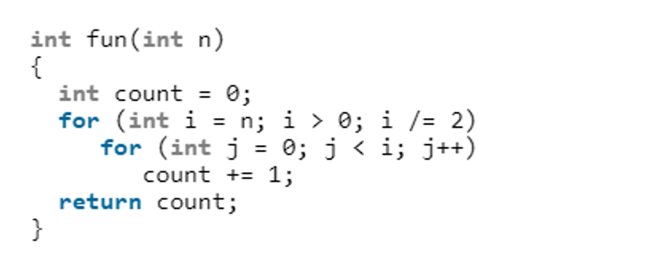
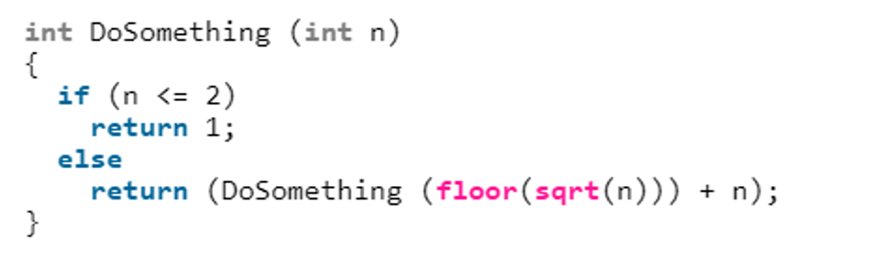

# Homework week 1: Algorithm Analysis

## 1. Bài 1: W(n), A(n) lần lượt là thời gian chạy trường hợp xấu nhất và trung bình của thuật toán có kích thước là n. Điều nào dưới đây luôn đúng?

- [x] Chọn đáp án C

## 2. Bài 2: Độ phức tạp của hàm fun()?

* Ở vòng for thứ nhất, với i = n thì vòng for thứ 2 sẽ chạy n lần
* Ở vòng for thứ nhất, với i = n/2 thì vòng for thứ 2 sẽ chạy n/2 lần
* Ở vòng for thứ nhất, với i = n/4 thì vòng for thứ 2 sẽ chạy n/4 lần
* ...

Như vậy số lần chạy cho cả 2 vòng for là: n + n/2 + n/4 + ... = 2n (tổng của cấp số nhân lùi vô hạn)

=> Độ phức tạp hàm fun(): O(2n) = O(n)

## 3. Bài 3: Độ phức tạp của hàm đệ quy sau là bao nhiêu?

